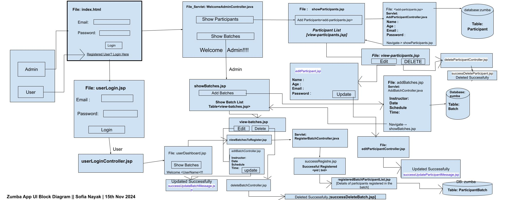

The jar file can be found inside the target folder.
# Zumba Website 

This application is designed to manage the enrollment and scheduling of students for Zumba classes. It features two main modules:

## Modules:
1. **Admin**: The admin has full control over the system, including managing participants and batches.
2. **User**: The user (participant) can log in to view available batches and register for classes after the admin has registered them.

## Login Credentials:

### Admin Login:
- **Authentication Method**: Hard-coded
- **Email**: `admin@zumba.com`
- **Password**: `admin@123`

### User Login:
- After the admin registers a participant, the user can log in using their **Email** and **Password** to access their personalized dashboard and enroll in available batches.

## Steps to Run the Project:

1. **Clone the Repository**:
   ```bash
   git clone https://github.com/nayaksofia/zumbaApp_MavenJsp.git
   ```

2. **Set up the Database**:
   - Ensure you have MySQL installed.
   - Create a database and import the provided schema file to set up tables for participants, batches, and enrollments.

3. **Configure Database Connection**:
   - Update the database connection details in the configuration file (`DB.java`) to match your local MySQL setup.

4. **Run the Application**:
   - Use a Java IDE (like IntelliJ IDEA or Eclipse) or run the project using Maven
   - Access the application through your web browser.

5. **Log in as Admin**:
   - Use the admin credentials to log in and manage participants and batches.

6. **Log in as User**:
   - After admin registration, users can log in with their email and password to register for batches.

## Block Diagram


